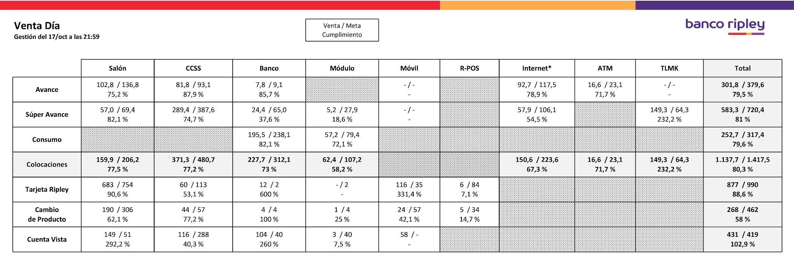
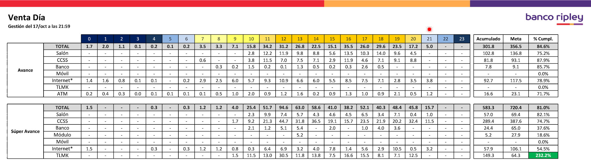

# Data Engineering Portfolio
Repository containing Enrique Ulloa's portfolio of data engineering projects. Projects are presented in Jupyter Notebooks using Python and other technologies.

## Contents

### [User Behavior in an Educational Social Network (Part 1)](https://github.com/enriqueulloap/portfolio/blob/master/User%20Behavior%20in%20an%20Educational%20Social%20Network%20(Part%201).ipynb)

In this project, I built a Pipeline to load JSON data into a MongoDB database to make data exploration and get a better understanding of the problem.

### [User Behavior in an Educational Social Network (Part 2)](https://github.com/enriqueulloap/portfolio/blob/master/User%20Behavior%20in%20an%20Educational%20Social%20Network%20(Part%202).ipynb)

In this project, I created a Transformation to generate a dataset to analyze the user behavior in an Educational Social Network.

### Omnichannel Sales Dashboard

This dashboard was created to support the omnichannel strategy of a bank, showing information for all its products and channels. It gathers data from the different platforms used in the company, i.e. retail stores, bank offices, website, mobile applications, telemarketing, ATM, etc.

### Credit and Debit Cards Report

This report shows new cardholders and customers getting a product upgrade. It features sales objectives, charts and rankings with the best and worst store performances. Before this report, the managers had no way of knowing their performance during weekends, the days with the largest influx of public. Now they get this report automatically in a daily and hourly basis.

### Consumer Loans Report

This report shows the Consumer Loans sold in the bank offices per hour. It has a comparatives with the best day and the same day of the previous month, along some productivity KPI such as Executives without sales, Offices without sales, Operations per executive, etc.

