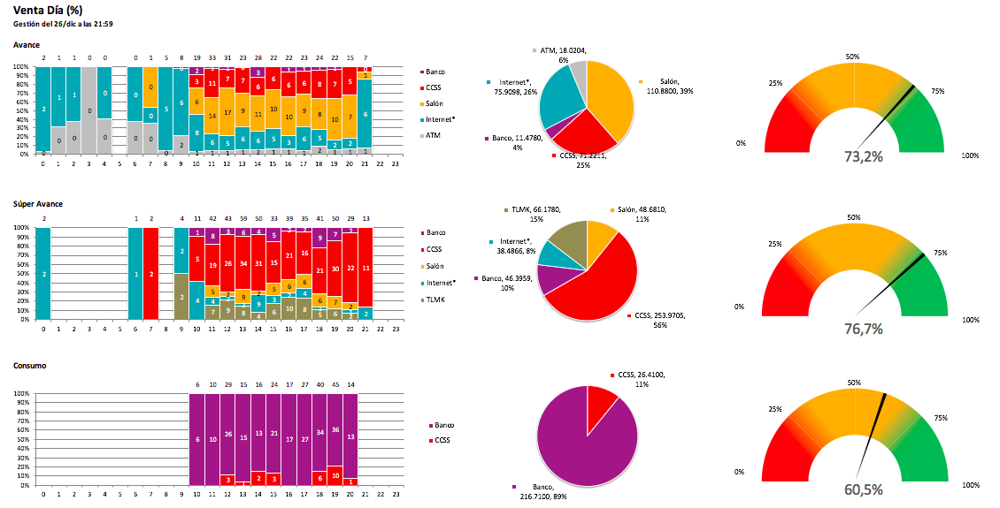
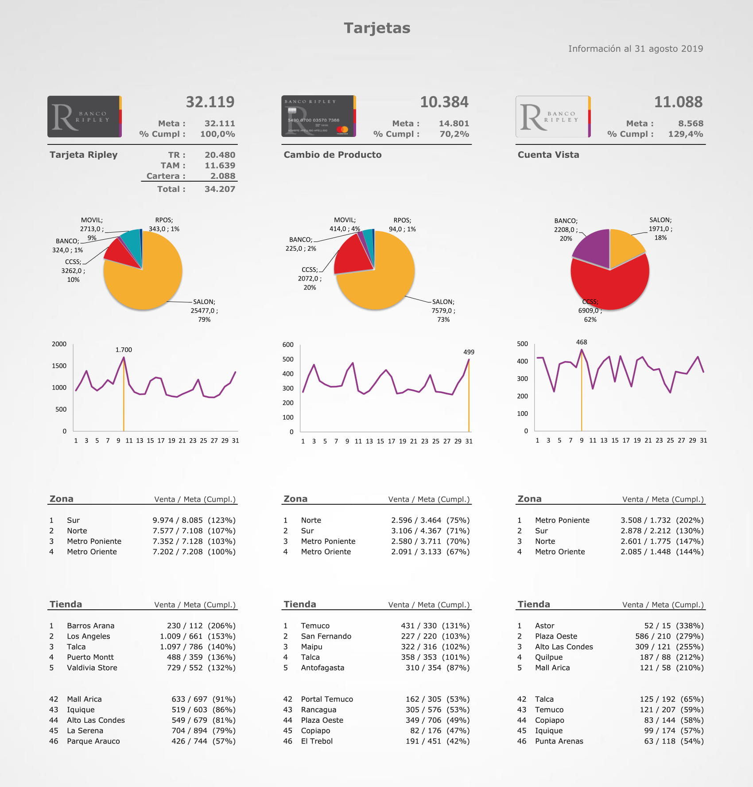
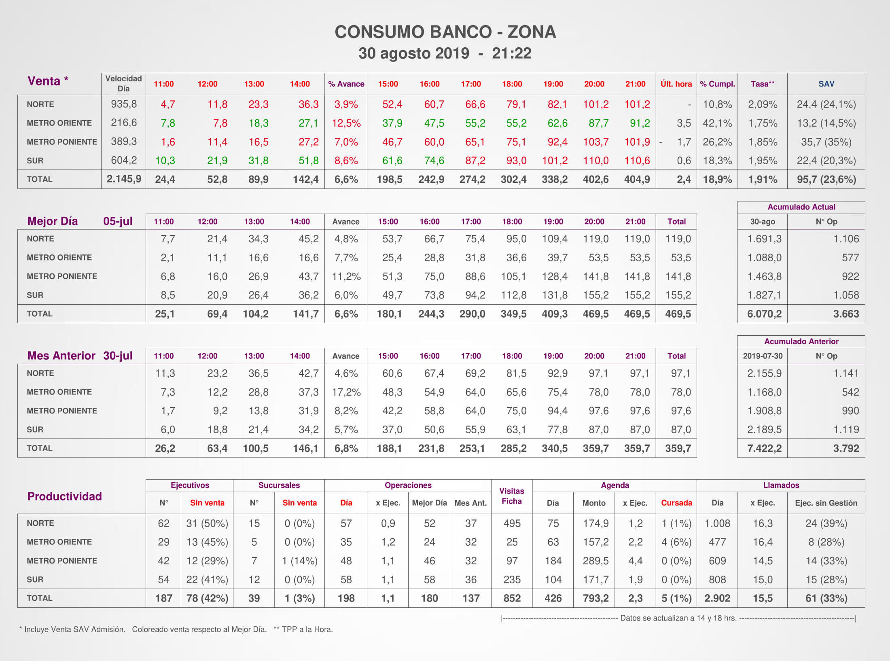

# Data Engineering Portfolio
Repository containing Enrique Ulloa's portfolio of data engineering projects. Projects are presented in Jupyter Notebooks using Python and other technologies.

## Contents

### [User Behavior in an Educational Social Network (Part 1)](https://github.com/enriqueulloap/portfolio/blob/master/User%20Behavior%20in%20an%20Educational%20Social%20Network%20(Part%201).ipynb)

In this project, I built a Pipeline to load unstructured data into a MongoDB database to determine what information we must extract to analyze the user behavior in an Educational Social Network.

### Omnichannel Sales Dashboard

This dashboard was created to support the omnichannel strategy of a bank. It gathers data from the different platforms used in the company, i.e. retail stores, bank offices, website, mobile applications, telemarketing, ATM, etc.

### Credit and Debit Cards Report

This report was created to track the quantity of new cardholders and how many customers are getting a product upgrade. It features charts and rankings of the best and worst performances.

Before this report, the managers had no way of knowing their performance during the weekends, the days with the largest influx of public. Now it is sent automatically in a daily and hourly basis.

### Consumer Loans Report

This report shows the Consumer Loans sold in the bank offices along with some productivity KPI.

It is a redesign of one that was malfunctioning (it was sent duplicate, with erroneous figures and late). I rebuilt the process with a focus on speed and reliability in information and delivery.

